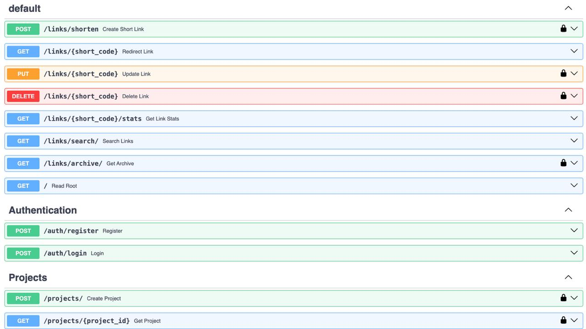

# Отчет по реализации сервиса

## 📌 Обязательный функционал (реализовано 5/5)

## Итоговый вид интерфейса FastAPI

### 1. Базовые операции с ссылками (CRUD)
- **Создание (POST /links/shorten)**  
  Поддержка генерации коротких ссылок с:  
  - Автоматической генерацией кода или кастомным алиасом  
  - Указанием времени жизни (`expires_at`)  
  - Проверкой уникальности алиаса

- **Редирект (GET /{short_code})**  
  - Перенаправление на оригинальный URL  
  - Автоматическая архивация при истечении срока  
  - Кэширование запросов  

- **Обновление (PUT /{short_code})**  
  - Изменение оригинального URL (только для владельца)  
  - Инвалидация кэша  

- **Удаление (DELETE /{short_code})**  
  - Удаление ссылки (только для владельца)  
  - Очистка связанных данных кэша  

### 2. Статистика переходов (GET /{short_code}/stats)
- Отображение:  
  - Количества переходов  
  - Даты создания и последнего использования  
  - Срока действия ссылки  
- Кэширование результатов на 1 минуту  

### 3. Кастомные алиасы
- Проверка уникальности через БД  
- Запрет использования занятых алиасов  

### 4. Поиск по оригинальному URL (GET /links/search)
- Возврат всех совпадений  
- Кэширование результатов поиска  

### 5. Время жизни ссылок
- Автоматическая архивация при истечении `expires_at`  
- Ручное указание даты удаления с точностью до минуты  

---

## Дополнительные функции

### 1. История архивных ссылок
- Просмотр архивированных ссылок (GET /links/archive)  
- Фильтрация по пользователю   

### 2. Группировка по проектам
- Создание проектов  
- Привязка ссылок к проектам  

---

## Система аутентификации
- Регистрация/вход по JWT-токенам  
- Защита операций изменения данных:  
  - Проверка прав владельца  
  - Запрет модификации анонимных ссылок  

---

## 🗄️ Архитектура хранения данных

### База данных (SQLite)
- **Основные сущности:**  

### Кэширование (Redis)
- **Сценарии использования:**  
  - Редиректы (TTL: 1 час)  
  - Статистика (TTL: 1 минута)  
  - Результаты поиска (TTL: 1 час)  
- **Инвалидация кэша** при изменении/удалении ссылок  

---

## 📊 Оценка соответствия критериям

*Дополнительные баллы могут быть начислены за:*
- Реализацию сложных сценариев кэширования  
- Систему группировки ссылок  
- Расширенную обработку ошибок  
